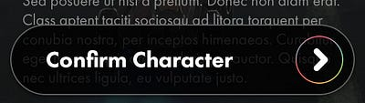
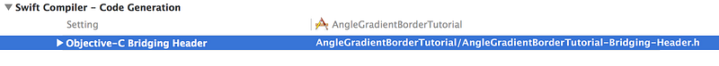
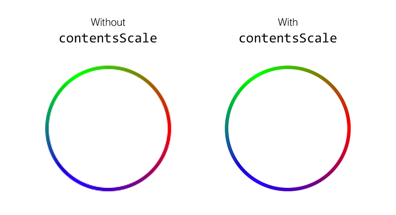
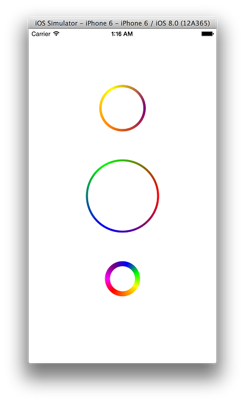

Adding a border to a UIView is straight forward enough, but adding a gradient border (let alone an angle gradient border) not so much.

## The Problem

1.  Adding a gradient border to a UIView needs to be manually drawn within the CGContext of the view.
2.  CGContext gives you linear and radial gradients out of the box, but not angle gradients!

## My Problem



In February of 2015, my company launched a mobile game called [Role](http://www.roleapp.com). My co-founder and Creative Director, [Logan Dwight](http://www.logandwight.com), recently sent me a mockup with this button in it. Little did I know, that circle around the arrow would haunt me for days.

## The Solution

### 1\. **Download** [**AngleGradientLayer**](https://github.com/ianhirschfeld/AngleGradientLayer)**.**

It is a fork of [this awesome repo](https://github.com/paiv/AngleGradientLayer) by Pavel Ivashkov. I had to make two tiny changes for it to play nice as a stroke rather than a fill.

### 2\. Import AngleGradientLayer into your Swift project.

This will require making a bridging header because AngleGradientLayer is written in Objective-C.

- Create a file named **\[YourProject\]-Bridging-Header.h**
- Go to your project’s **Build Settings**. And add your bridging header file under the **Swift Compiler — Code Generation** section:



- Once you have your bridging file setup. Add **AngleGradientLayer.h** to it:

<script src="https://gist.github.com/ianhirschfeld/a0a3a6fdb48b186cc631.js"></script>

### 3\. Subclassing AngleGradientLayer with AngleGradientBorderLayer

Now that we can create angle gradients in Swift, we need to subclass AngleGradientLayer with something that lets us use the gradient layer as a border. Thus, we create **AngleGradientBorderLayer.swift**:

<script src="https://gist.github.com/ianhirschfeld/6bb89d3ebc3fbdf79c99.js"></script>

### 4\. Creating AngleGradientBorderView

With AngleGradientBorderLayer all set up we are now ready to create a view that uses it, **AngleGradientBorderView.swift**:

<script src="https://gist.github.com/ianhirschfeld/106abafc9542797eceec.js"></script>

I’d like to re-iterate the importance of one part of this file:

```
l.contentsScale = UIScreen.mainScreen().scale
```

This will essentially take our gradient layer (which is rendered as an image) and make it retina. Below illustrates this affect:



### 5\. Use AngleGradientBorderView and admire your borders!



You can add UIView’s to your storyboard, assign them the AngleGradientBorderView class, and adjust their colors / border widths.

## [Download the Source Code](https://github.com/ianhirschfeld/AngleGradientBorderTutorial)
