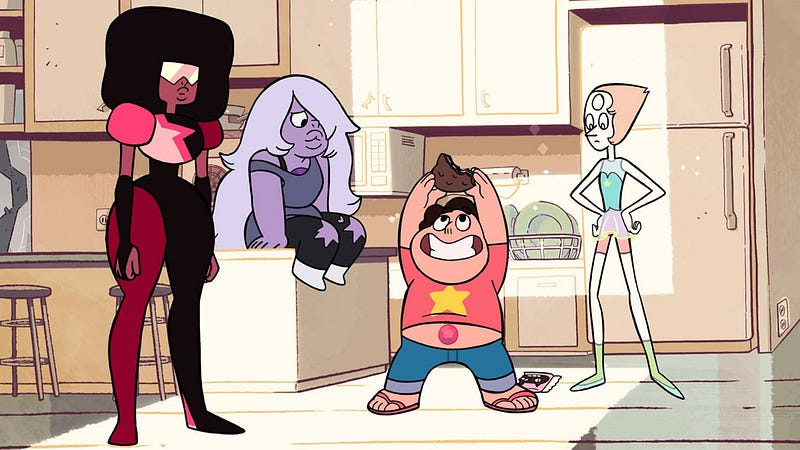

A curated collection of high-quality games, movies, TV, music, books, comics, and internet stuff. Celebrate the colorful, creative, and strange.

Today, [The Soap Collective](http://www.thesoapcollective.com) is proud to announce the release of [Weird Catalog](http://www.weirdcatalog.com)! What is Weird Catalog? Well, it’s a discovery site of some of the coolest, weirdest media that we’ve come across.

We absorb a lot of different media ranging from movies, tv, and comics to music, apps, and games. Over the years we’ve collected a lot of really “weird” media. We’ve found that there is a lot of high-quality fun, cool, and deep weird out there. So we decided to build a site where we could curate and share the content we’ve enjoyed.

Here is a sample of some weird media that may have slipped under your radar:

#### [Attack The Block](http://www.weirdcatalog.com/ci/attack-the-block)

A gang of hood kids save their neighborhood from an invasion of furry alien gorillas with glowing teeth.

[Get it here](http://amzn.com/B005J4TLQG?tag=weircata-20)

#### [Steven Universe](http://www.weirdcatalog.com/ci/steven-universe)

Boy with a pink stone in his belly button lives with a magic-girl-super-team in a quiet beach town.

[Watch it here](http://amzn.com/B00G90794U?tag=weircata-20)

#### [Remember Me](http://www.weirdcatalog.com/ci/remember-me)

French assassin uses hologram glove to remix people’s memories in cyberpunk Paris.

[Get it here](http://amzn.com/B008XMSR6G?tag=weircata-20)

#### Get inspired. Get weird.

[http://www.weirdcatalog.com](http://www.weirdcatalog.com)

Follow us on [Twitter](https://twitter.com/weirdcatalog) and [Facebook](https://www.facebook.com/weirdcatalog).
