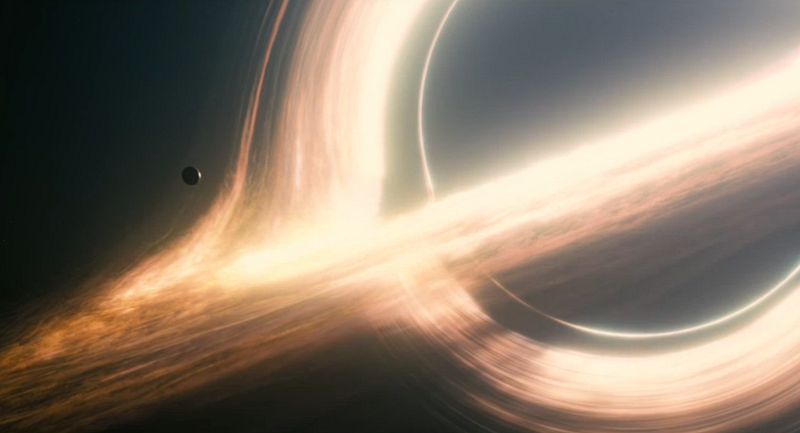
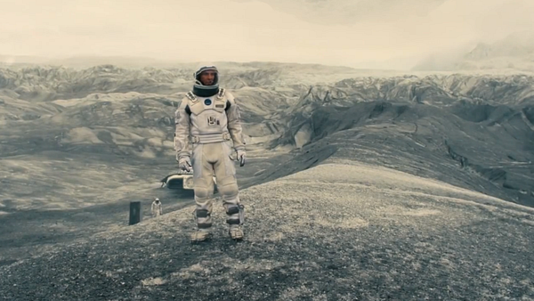

# Interstellar

### Epic space cinematography, a beautiful score, theoretical physics, and emotions, so many emotions.

## What I Wanted

I’m a big fan of Christopher Nolan’s work, so when I heard he was doing a movie about space, I was excited. Based on his past films, and the first trailer for the movie, here were my expectations:

1.  We would get a visually stunning grand scale adventure in space.
2.  We would get a film that has something to say about our desire as a species to want to know what mysteries lie beyond our galaxy.

## What I Got

Upon leaving the theater, I was in awe. I loved the film! It gave me the things I wanted and more. Here were my key take aways:

### 1\. Epic Space Cinematography

Whenever a movie is set in space, I hope for some cool compositions, and _Interstellar_ certainly delivered. The movie is filled with awe inspiring shots of black holes, new planets, space stations, and more. I saw the film in its original 35mm version and everything looked great. I can imagine that the IMAX took some of these shots and elevated them even further.

### 2\. Beautiful Score

Hans Zimmer has once again crafted an incredible score. Throughout the film the music flows in and out of scenes to help guide their emotional impact. There were moments when the music would come roaring in, shaking me in my seat and giving me a sense of propulsion, or getting my adrenaline pumping in line with the action unfolding on the screen. Then there were moments when the music faded to silence, letting the nothingness of space engulf me.

### 3\. Theoretical Physics

Nolan gives us a version of his take on high level theoretical physics and how we can not only wrap our minds around it, but also become intrigued by it. Here are the two bigs ones:

**Time Dilation —** Every instance of time dilation in the film was followed by a heavy emotional scene. We see the characters come to terms with knowing everything they just experienced was on a completely different time scale than those around them.

**The Fifth Dimension —** If we were fifth dimensional beings and could see the fourth dimension (time), what would it look like? This was one of the coolest portrayals in the film. Nolan created a vision of what this could be like, and what it could mean in terms of our ability to operate at a higher dimension.

### 4\. Emotions, So Many Emotions

If there was one thing that _Interstellar_ did so completely right, it was the emotional impact that it delivered. There were heavy themes of love, ranging from the love a father has for his children, to the love a species has to survive, to the love any one individual has to “rage against the dying of the light”. To let yourself be fully engaged with this film, is to go on an emotional roller coaster of highs and lows that will most certainly result in tears.

## My Verdict

### Amazing.

_Interstellar_ delivered what I wanted and more. There was adventure, interesting physics, and emotional impact. Everything else was gravy, and anything it was lacking didn’t detract from the film. Christopher Nolan has once again created a great movie that everyone should experience.

## Who Should Watch Interstellar?

Christopher Nolan fans, space aficionados, sci-fi lovers, romantics, fathers, daughters, physicists, those afraid of death, and anyone who loves world ending grand adventures.
