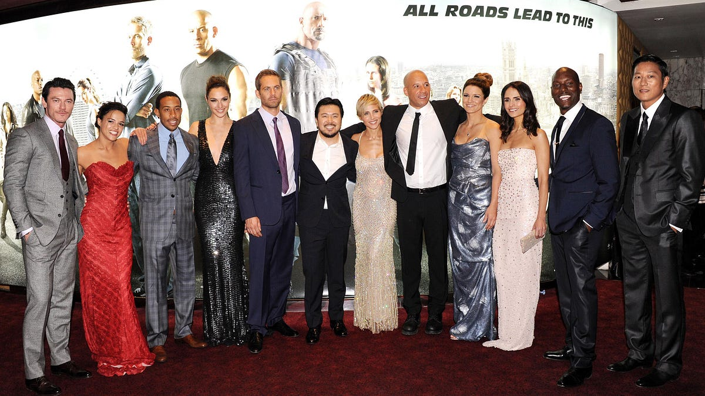
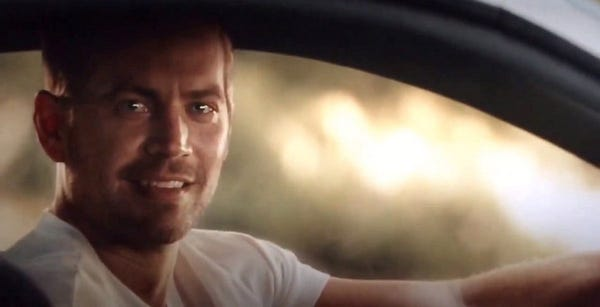
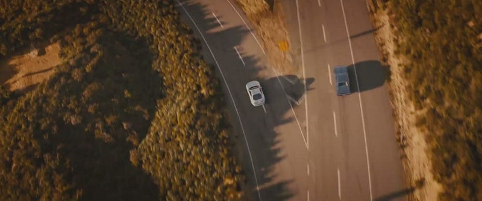

## What I Wanted

At this point in the series I only expect a couple things: a “bad” but very fun movie, and crazy stunts. Oh, and also Dwyane Johnson.

## What I Got

This latest installment certainly delivered! It has even elevated the franchise from being “bad”, to being so good that it deservedly broke box office records.

### 1\. Insane Stunts

Street racing, which was the foundation of the series, has definitely taken a back seat. It has been replaced with the craziest stunts (that you can still do in a car) that the writers can come up with.

One of the crazier stunts in the film (which there are several more of) involved sending the crew parachuting out of a military plane, while in their cars, so that they could ambush the convoy of a different rogue military group.

### 2\. Superbly Good-Bad Dialogue

A growing staple of the series is the hilariously good-bad character dialogue littered throughout the script. I’m talking about lines like:

> “I’m gonna put a hurt on him so bad, he’s gonna wish his momma had kept her legs closed.”

Which is delivered by none other than Hobbs played by Dwayne Johnson. What makes lines like this so great, instead of so terrible, is that _Furious 7_ is very aware of itself. The film knows it’s not supposed to be very deep or layered. It accepts itself as is and successfully creates characters that are playful and funny, even in serious situations.

### 3\. Diversity

It would be a disservice to the evolution of the film series to not make note of its diversity. Over the course of seven movies, _Furious 7_ has become a showcase on how a diverse cast is not only refreshing, but in high demand both domestically in the U.S. and internationally.

### 4\. A Tasteful Goodbye

Going into the movie I was wondering how the film would handle the death of Paul Walker. Would his character be written off mid movie? Or would they keep him throughout the film and have an inevitable happy ending without really referencing his death? They managed to do a little of both. Paul Walker’s character, Brian, is in the whole movie by having his brothers stand in as actors. The ending scene also fairly seamlessly transitions into a tribute to Paul Walker. It was an emotional and an appropriate goodbye as Brian drives off into the distance on his own path.

## My Verdict

### So much fun!

Overall, _Furious 7_ delivers pure fun. From start to finish the film, and the characters within it, know exactly what they should be. The movie is goofy, funny, semi-serious, sappy and all while crammed between, and sometimes in, crazy action packed scenes. It is the pinnacle of the blockbuster movie.

## Who Should Watch Furious 7?

If have been following along with _The Fast and Furious_ series, then this is a must. If you’ve never seen any of them watch _The Fast and the Furious,_ then skip to _Fast Five,_ then _Fast & Furious 6,_ and then make your way to _Furious 7_. Anyone else looking for unbelievable yet plausible action or cheesy yet not-to-cheesy humor should check this movie out.
