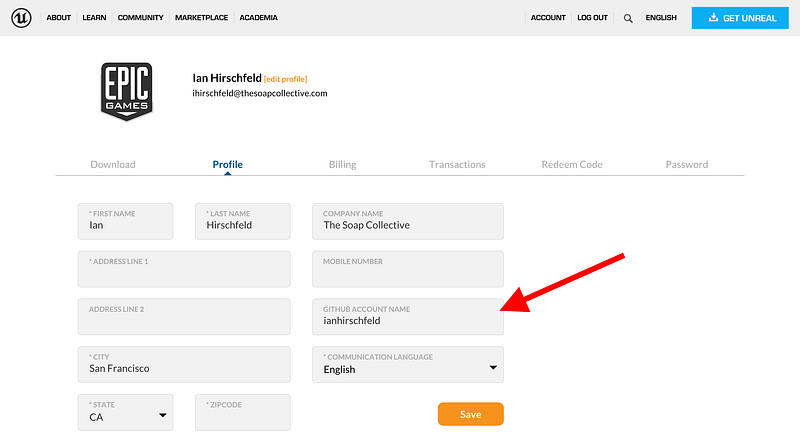
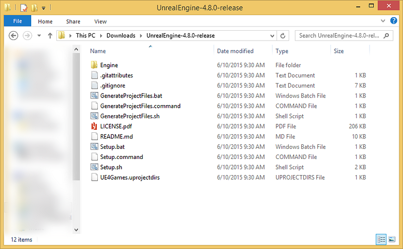
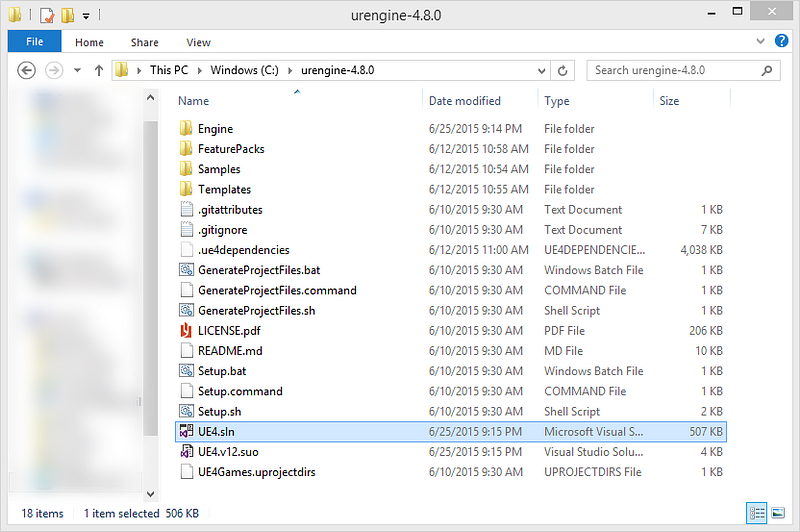
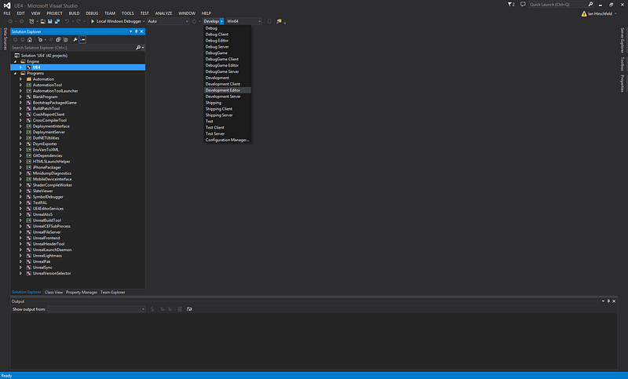
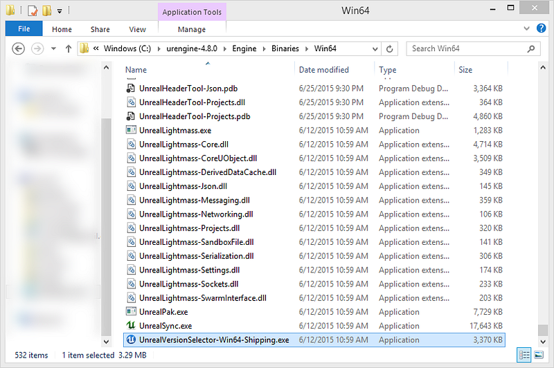

UEv4.8 freshly booted up after being compiled from source.

The process and source material for this guide comes from [**Michael Allar**](https://twitter.com/MichaelAllar). I am simply taking his video walk-through and creating a written step-by-step guide.

Video walk-through by [Michael Allar](https://www.youtube.com/channel/UCXkrfkh3rtu08D1fZlhbPpw)**.**

_Note: The numbers for each step below link to the corresponding section of the video, if there is one._

### 1\. Sign up for [GitHub](https://github.com/join) and [Unreal Engine](https://accounts.unrealengine.com/login/index).

If you don’t already have an account at both these sites, you’ll need them to download the source code for Unreal Engine.

### 2\. [Connect](https://www.unrealengine.com/settings) your GitHub account to your Unreal Engine account.

You should see a section labeled **GitHub Account Name**, on your settings page. Once you enter in your GitHub account and save your profile, you’ll be invited to join the [EpicGames GitHub organization](https://github.com/EpicGames).



### [3.](https://youtu.be/dZck7_4vlYI?t=44s) [Download](https://github.com/EpicGames/UnrealEngine/releases) the Unreal Engine source code.

Once you have joined the EpicGames GitHub organization, you’ll see a private repo called **UnrealEngine**. In the repo, head to the **Releases** page and grab the latest release. As of 6/25/2015, it’s **v4.8.1**.

### [4.](https://youtu.be/dZck7_4vlYI?t=1m30s) Unzip the source code onto your computer.



### 5\. Run Setup.bat.

This downloads a bunch of files required to do the next step and might take a few minutes to complete. _Note: This step is missing from the video._

### [6.](https://youtu.be/dZck7_4vlYI?t=2m45s) Run GenerateProjectFiles.bat.

This should run fairly quickly.

### [7.](https://youtu.be/dZck7_4vlYI?t=3m6s) Compile the Unreal Engine Visual Studio solution.

Open up the UE project solution. If you are building v4.8 then the file should be named **UE4.sln**. _Note: If you don’t already have Visual Studio, you can get it_ [_here_](https://www.visualstudio.com/downloads/download-visual-studio-vs#d-express-windows-desktop)_._



### [8.](https://youtu.be/dZck7_4vlYI?t=3m15s) Set development mode and build solution.

Once Visual Studio is open and the project has loaded, you need to update the “Solutions Configuration” and set it to **Development Editor**. This can be found in the dropdown pictured below. Next, find the UE4 project in “Solution Explorer” on the right. It will be under **Engine > UE4**. Right click the project and select **Build**. This step will take some time (at least 15–20 minutes). You’ll know it’s finished once you see “Build: 1 succeeded, 0 failed…” in the Output panel at the bottom of Visual Studio.



### [9.](https://youtu.be/dZck7_4vlYI?t=5m34s) Register your compiled version of Unreal Engine as an editor.

After Visual Studio is done building the project, go back to your engine directory and find the Version Selector Tool. It should be located in **\[Root\] > Engine > Binaries > Win64 > UnrealVersionSelector-Win64-Shipping.exe**. Double click it and select “Yes” when it asks, “Register this directory as an Unreal Engine installation?”.



### [10.](https://youtu.be/dZck7_4vlYI?t=6m10s) (Optional) Create a shortcut in the root directory.

At this point you’re all set! To run your newly compiled-from-source version of Unreal Engine simply navigate to **\[Root\] > Engine > Binaries > Win64 > UE4Editor.exe** and double click it. If you prefer (which Michael and I both do), you can create a shortcut from the root to quickly run Unreal. In your root directory, create a new file named **Editor.bat,** right click it, and select “Edit”. Paste the following code:

```
start Engine\Binaries\Win64\UE4Editor.exe
```

Now you can use Editor.bat to launch Unreal Engine! :D
