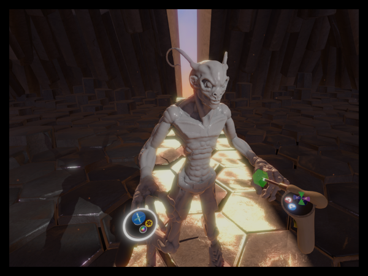
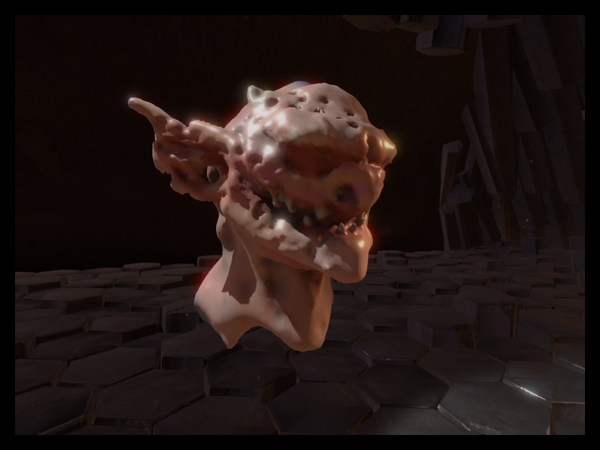
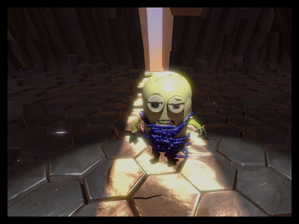
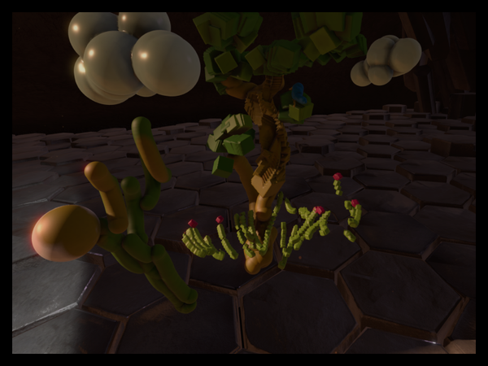

It’s been a few weeks since Oculus Connect and there is one experience I have not been able to stop thinking about: [Medium](https://twitter.com/oculusmedium).

During the conference, Oculus CEO Brendan Iribe, introduced Medium by saying it was Oculus’ “Paint App”. It was a casual way to reveal an application that I believe will be massively successful as the Rift CV1 and Touch controllers launch next year. Here’s a short list of why I think Medium is _the app_ going into 2016:

### Intuitive Controls

The team did a fantastic job of merging the tools from traditional sculpting with the current digital paradigms that many people know from software like Photoshop and Maya. In addition, Medium requires Oculus’ new Touch controller, which is as cool and awesome as you think it would be. This combo made the Medium experience so easy to learn! Whether I was pulling out corners of cube, smoothing jagged edges, or spray painting my sculpture, all the controls felt natural. So much so, that Medium was the first VR application that I honestly thought I could spend hours in. Which leads me to…

### Immersion AND Comfort

Medium absolutely nails both immersion and comfort! I never felt queasy, even for a moment (nor did anyone else I spoke to who tried Medium), and my presence in the space felt real. The environment acts mostly as a backdrop to ground you in virtual space. This creates focus on sculpting, and gives the app a well defined and understood core experience. It also allows you to interact either seated or standing, while creating an experience where it is assumed you won’t be walking around. This instantly removes one of the fastest ways to make someone feel sick in VR. What’s also great is everything looks like you can just reach out and touch it, and you can! The pushing and pulling of your sculpture is super responsive, and the main spot light in the room sits slightly above you, within reach, so you can quickly move it wherever you want. As soon as I was put into Medium, I didn’t want to leave and I just wanted to play all day.

### Fun for Everyone

One of the biggest reasons I think Medium will be an instant success, is that it is truly an experience anyone can jump into and immediately start having fun. Everyone likes to create, and an activity like sculpting is either very messy in real life, or has a steep learning curve with programs like ZBrush. Medium solves both of these problems, which drastically lowers the barrier of entry for creativity. There is also huge potential for not only sharing your sculptures, but actually sculpting with others in realtime anywhere in the world.

### Unique to Virtual Reality

Much of the power of Medium is that you really feel like it can’t be done any other way or with any other technology. The cohesiveness of the head tracking, hand tracking, and user interface is so good, that it makes the current generation of 3D software look like a stop-gap solution. Next year is going to be very exciting for VR, and Medium is an inspiring step towards the the future of interactive and immersive media.

And if you still aren’t convinced, check out some sculptures that people made _in under 15 minutes having never used Medium before_:

