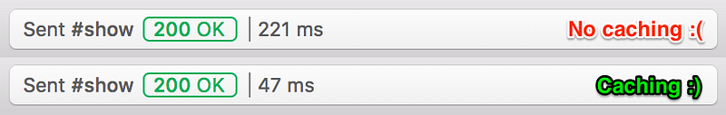

Add caching or your Rails app in just a few minutes!

### 1\. Add the Redis gem to your Gemfile.

```
gem 'redis-rails'
```

### 2\. Update your production.rb environment.

I recommend using your `REDIS_URL` environment variable as a switch to decide whether or not to use `:redis_store`.

```
config.cache_store = :redis_store if ENV['REDIS_URL']
```

### 3\. (Optional) Update your development.rb environment.

This will give you a quick and easy way to test caching locally. If your local environment variables contain `REDIS_URL` caching will be turned on, otherwise it will be disabled (which is the default for `development.rb`).

```
if ENV['REDIS_URL']  config.action_controller.perform_caching = true  config.cache_store = :redis_storeelse  config.action_controller.perform_caching = falseend
```

### 4\. Cache some views!

This example is using a jbuilder view:

```
json.cache! [‘api’, ‘v1’, @posts], expires_in: 1.month do  json.posts(@posts, partial: 'api/v1/posts/post', as: :post)end
```

Line 1 of the above tells jbuilder that we want to create a cache key with values “api”, “v1”, and an autogenerated string based off the current set of posts we’ve gathered for display. For example the cache key might look something like this: `api-v1-posts-2015123001253`. We are also setting this particular cached view to expire after one month.

Line 2 of the above is the code to have jbuilder actually render our view. We are telling jbuilder to output json with the key “posts”, and for it to be an array based on the posts we are passing into it.

### 5\. Add the [Heroku Redis](https://elements.heroku.com/addons/heroku-redis) addon to your app.

If you like to use your console instead:

```
heroku addons:create heroku-redis:hobby-dev
```

### 6\. Deploy your app and bask in the glory of your improved render times!


