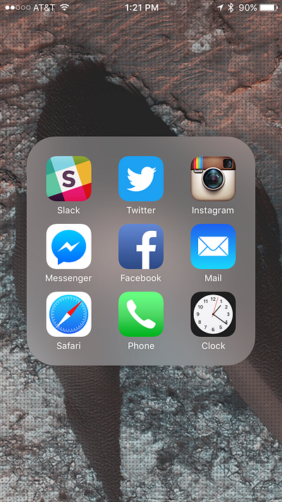
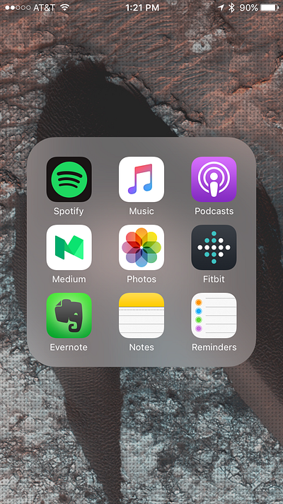
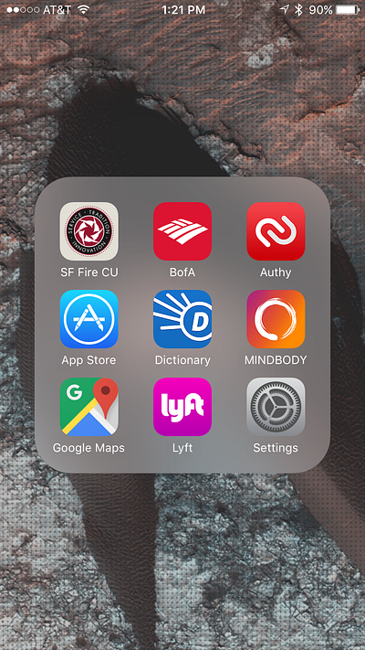

Here are the apps I value most and give space to on my homescreen and tray. Although to be honest, I use my homescreen lightly in favor of a mega-loaded tray. This allows me to keep more apps accessible from lower on my screen and allows me to always be able to view my background art almost completely uncovered.

#### Top Row

The only apps I keep on my homescreen are Calendar and any apps I’ve made or are currently working on, at the moment: [Role](http://www.roleapp.com/), [Envoy](https://envoy.co/), and [Phoodie](https://www.phoodielife.com/). I used to only keep Calendar, and that was because iOS requires at least one app on the first page of your homescreen.

#### Super Tray

The rest of my most used apps are all located in my “Super Tray”. I’m big fan of the springboard folders and as soon as I discovered I could put folders in my tray, I took advantage. Since texting is my most used app, I keep that one out and immediately accessible. My three tray folders are relatively grouped by type. Folder one is full of social and information apps, folder two is my media apps, and folder 3 are miscellaneous (images below).

All in all this keeps my homescreen organized and uncluttered and gives me access to my top 32 out of 109 apps installed on my phone.

