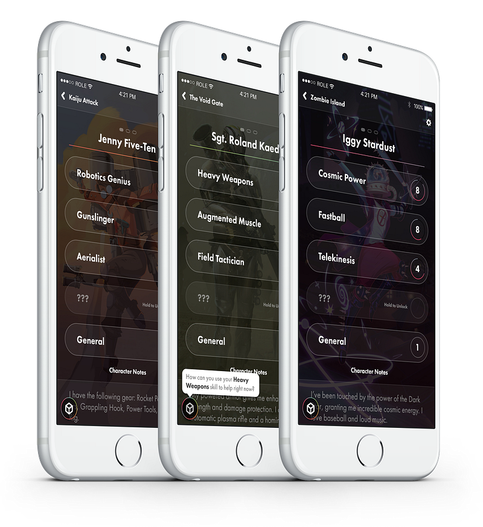
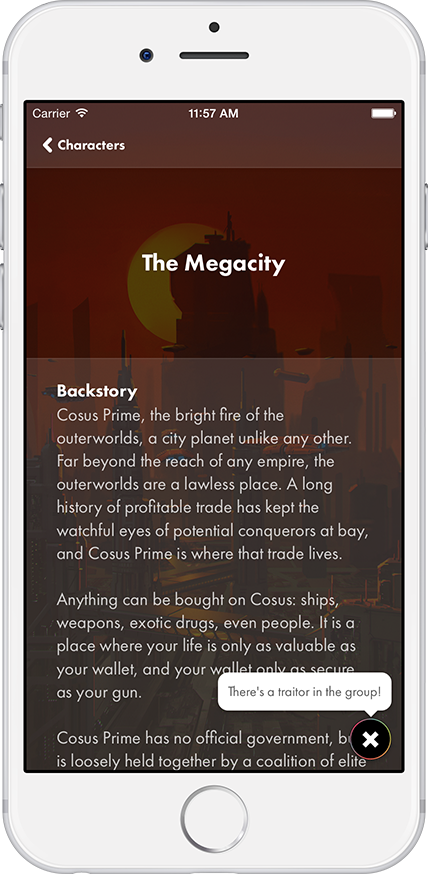

The Soap Collective is extremely excited to announce [**Role**](http://www.roleapp.com/), a group storytelling adventure game for [iOS](https://itunes.apple.com/us/app/role-a-role-playing-party-game/id933599454?mt=8) and [tabletop](http://www.roleapp.com/downloads/Role_Gameplay_Primer.pdf)!

## **Imagine Together**

With Role, we’re trying to change what it means to be a “social game”. Building on the foundations of traditional pen & paper role playing games, Role is played face-up and in-person. The goal of the game is to get people telling stories as a group, focusing on real interpersonal interaction and creativity. Role isn’t played using Facebook requests and resource boosters. It’s played around the table, on the couch, at a bar, on a camping trip, anywhere you can get a group of people together talking.

## **Be Anyone, Go Anywhere**

We’re designing Role for pick-up-and-play fun. Much like traditional tabletop RPGs, players create fictional characters and participate in a turn-based adventure that is organized by a player known as the “Game Master”. Unlike most of those games, though, Role is built to be ultra-simple. We were inspired by games like _Apples to Apples_, _Cards Against Humanity_, and _Space Team_. We wanted to bring that same level of party game simplicity to storytelling games. Instead of thick rule books and piles of different dice, Role is played on your smartphone through simple and clear interactive prompts. Once you have the app, you shouldn’t need a pencil, paper, or dice to play. Everything is handled on your phone!

Looking for Android? We’re working on it! Sign up for our [mailing list](http://eepurl.com/6k_wT) to get notified when it’s ready.

_Originally posted on our_ [_Tumblr_](http://soapcollective.tumblr.com/) _in October of 2014._
