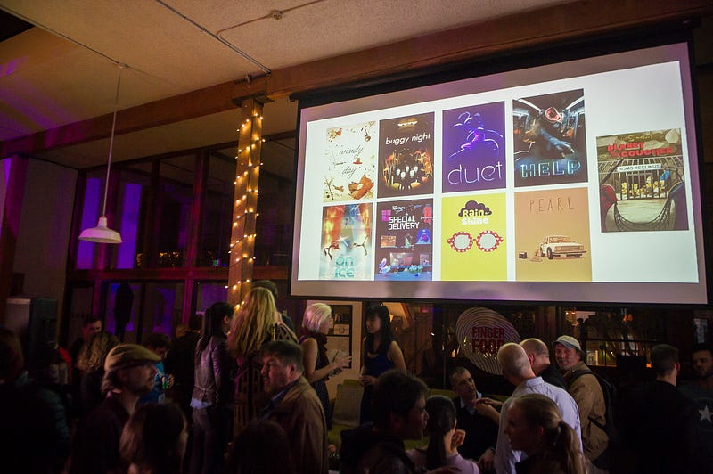
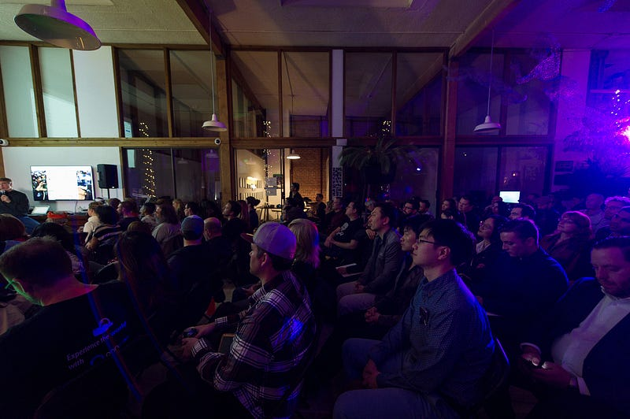

Last Thursday, an amazing panel of storytellers discussed their latest projects, and shared the lessons they’ve learned in creating narrative driven VR experiences. The panel was comprised of [Maureen Fan](https://twitter.com/baobabstudios), [Colum Slevin](https://twitter.com/colum), [Cassidy Curtis](https://twitter.com/googleatap), [Scott Hutchins](https://twitter.com/stanfordcw), [Ben Peck](https://twitter.com/bvpeck), and was moderated by [Rodes Fishburne](https://twitter.com/rodesfishburne). There was a ton of great knowledge shared by everyone, and as someone who is also working on [story driven VR](http://www.enteratlas.com), I did my best to write it all down! Below is just a handful of some of my favorite bits of wisdom discussed.

### On structure:

-   Storyboarding for VR is different than film. In VR, the user can look around and absorb the story at their own pace. This often requires stories that have more downtime between story beats. One team found that their six minute storyboard turned out to be a twenty minute VR experience.

> How long you can make your VR stories is a function of how comfortable the user is. The more comfortable the person is, the longer they can stay in VR.

-   Your story doesn’t need to be a fixed length. It should adapt to a viewer’s attention. If they look away, or go somewhere else, allow your story to wait for them to come back.

### On user experience:

-   A passive VR story is still valuable and exciting. Not all experiences need to be “active” or have complex interactions. Sometimes just being immersed is enough to be compelling.

> VR is a new medium. We need to let go of previous categories that make us say, “if I do this it’s a film, and if I do this it’s a game”.

-   The importance of sound cannot be understated. A person may have a limited field of view wherever they look, but sound is always 360 degrees. When done correctly, even if someone isn’t looking where you want them to, they will still be able to hear the story and the characters around them.

### On storytelling:

-   Film allows the viewer to feel empathy, but VR allows the viewer to _act_ on their empathy.

> Story is the most important aspect of the experience. If the story isn’t great, it doesn’t matter if it is told in VR.

-   Designing VR is a lot like improv. You never know where the user will look or what they will interact with, so your experience needs to be able to adapt.
-   Your audience is a spectrum of different intentions and desires. Users can choose where to look, where to go, and what to interact with. The best stories will be malleable to what the user is doing and when they are doing it. This will push us to reconsider how we think about pacing linear and branching narratives.

> “VR is best when we mix the empathy of film, the agency of games, and the motivations of real life.”

> — Maureen Fan

### Food for thought:

-   Many of the best stories are about conflict followed by change and growth. How can storytellers best utilize VR to empower users to experience conflict, and be the agents of change and growth within the narrative?
-   For VR to expand to mass market consumers there needs to be more content, and there needs to be thought into how that content is delivered. Nearly everyone on the panel agreed that episodic content distributed similarly to TV was a good path forward. So, as VR storytellers, how can we best create compelling episodic narratives?

_Thank you to_ [_VR Film Meetup_](https://www.meetup.com/vr-film/) _for putting on this event and_ [_Upload Collective_](https://uploadcollective.com/) _for hosting._
