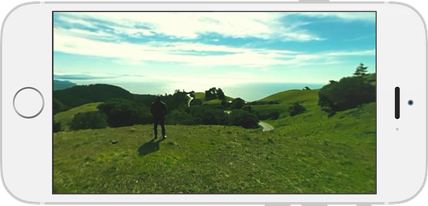
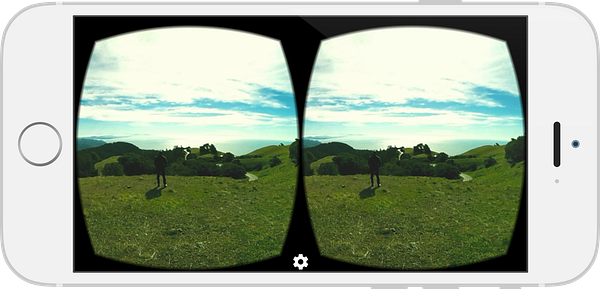
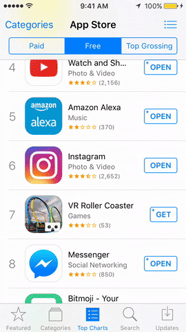

At [The Soap Collective](http://www.thesoapcollective.com), we help brands strategize how they can best use virtual reality to better connect with their customers. Throughout 2016, we found one of the best ways a company can get started in VR, _and_ reach customers, is through a 360 video mobile app.

You don’t always need to target high-end headsets such as the HTC Vive or Oculus Rift. With just a person’s smart phone, or with the addition of an inexpensive Google Cardboard, a user can experience VR for the first time through your brand.

## What is a 360 video mobile app?

A 360 video is the most accessible form of virtual reality currently on the market. It is a video where a user can look in any direction they want and there is something to see. Unlike a traditional video where the footage is constrained to a rectangle, a 360 video fills an entire sphere. For an example, check out this promo we created for artist Marina Berlin:

This video requires Chrome, Firefox, or IE 10+.

The benefits of producing 360 video content compared to more advanced VR content, is that 360 videos have much higher reach. Not only can you publish your 360 videos to Facebook, YouTube, and your own website, you can also package 360 videos inside a mobile app. Both the Apple App Store and Google Play Store support the development of virtual reality applications. This allows any company to create an app that they control, and gives them brand presence in both app ecosystems. With a mobile VR app, users can experience 360 videos in window mode or cardboard mode, allowing them to choose the level of immersion they would like in the moment.

By supporting Google Cardboard through your VR app, you have additional opportunities for brand awareness. Working with a vendor such as [DODOcase](http://www.dodocasevr.com/?ref=thesoapcollective), you can create custom branded Google Cardboards that you can distribute as part of a marketing campaign. In a project we did last year, we produced a 360 music video for independent artist Cameron Grey. The project also involved developing a VR mobile app, and designing custom branded cardboards for him to distribute.

## Are consumers aware of VR?

The short answer: Yes!

At the end of 2015, VR received a huge boost in awareness when the New York Times sent Google Cardboards to [_all of it’s print subscribers_](http://www.theverge.com/2015/11/5/9676840/nyt-vr-google-cardboard-app-the-displaced-released)_,_ and launched its very own [branded VR mobile app](http://www.nytimes.com/marketing/nytvr/). It was such a success, with over 600,000 downloads by April, that they decided to give away more Google Cardboards the following May.

Additionally, a [study](http://www.reportlinker.com/insight/2017-virtual-reality.html) conducted this past fall showed a large increase in public awareness of VR. From September 2016 to January 2017, there was a 15% increase in the number of people that felt they were “very familiar” with virtual reality.

Moreover, 2016’s holiday season showed VR mobile apps rising in the charts. Towards the end of December, 10 out of the top 25 free apps on the App Store were VR related.

## How are audiences responding to 360 video?

A [study conducted last year](http://www.magnifyre.com/360-degree-video-case-study/) by Magnifyre compared the effectiveness of a 360 video vs a traditional video on Facebook. They found that the average cost per 1,000 impressions of a 360 video campaign was not only significantly less expensive ($1.74 for 360 vs $4.20 for traditional), it also had a higher click-through rate. The CTR of a 360 video was 4.51% compared to 0.56% for a traditional video, and double the amount of viewers watched the 360 video all the way to the end.

A more [recent campaign](https://www.thinkwithgoogle.com/articles/360-video-advertising.html) put out by Google and Columbia Sportswear also had promising results for a 360 video vs a traditional video. Here were there findings:

- The 360 video had a higher click-through rate.
- Because 360 video is inherently interactive, engagement was higher. In their campaign the 360 video drove 41% more engagement.
- Viewers shared the 360 video 46% more than the traditional video.

## How should I start thinking about my brand’s VR content?

We are big believers in storytelling as the best way to engage customers. VR affords a level of agency and empathy that no other medium can offer. We’ve found that some of the most compelling brand experiences are story driven. When thinking about VR content that remains more true than ever. Here are some questions to think about while considering a branded VR mobile app:

- Why VR? What kinds of stories enable customers to _interact_ with my brand in ways no other medium allows?
- How can I bring customers _into_ my brand through VR?
- How does this VR app fit into my brand’s larger marketing campaign?

If want learn more about how you can use VR to strengthen your brand, and engage with your customers in new ways, sign up for our _Brands and VR Newsletter_ below to receive all of our latest VR marketing tips.

If you’re ready to find out how you can enhance your brand with VR _right now_, send us a message at [info@thesoapcollective.com](mailto:info@thesoapcollective.com).
