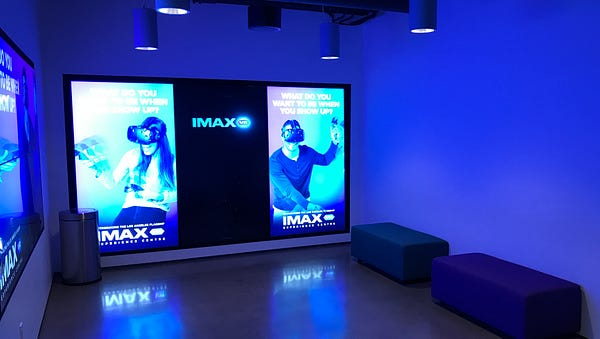
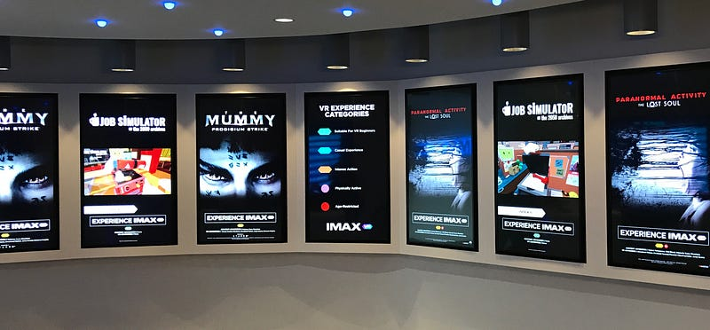
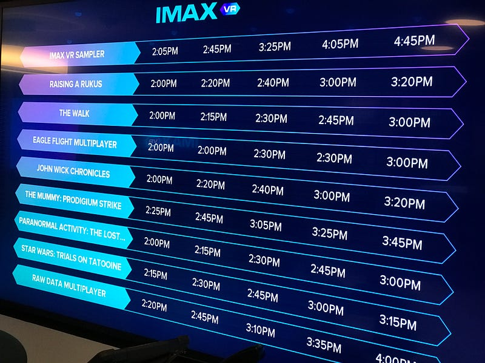
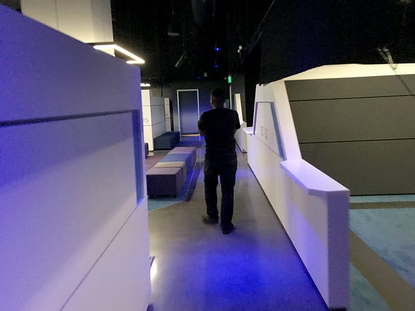
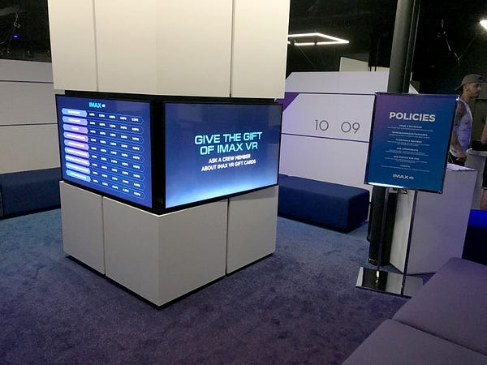
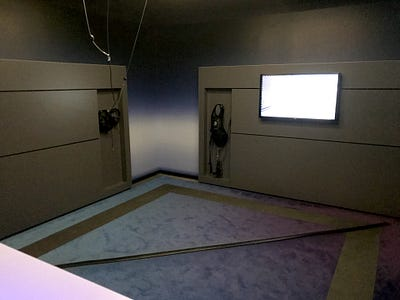
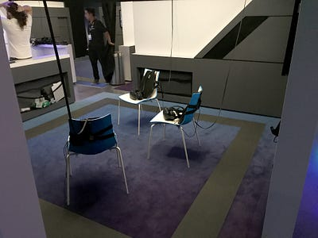
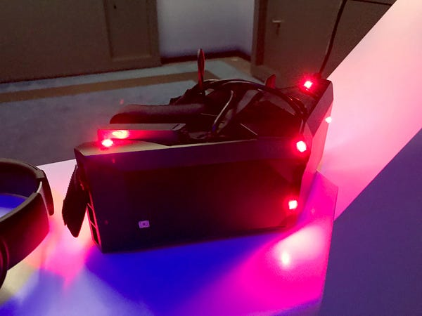
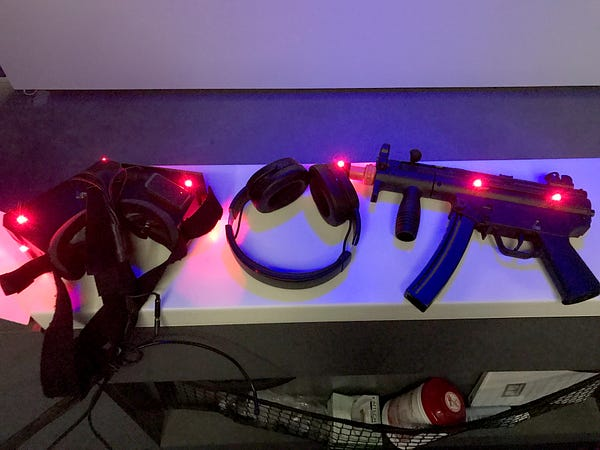

The inaugural IMAX VR has opened on Fairfax Avenue in LA. It has already boasted an impressive [20,000 unique visitors with ~$15,000 in weekly revenue](http://mashable.com/2017/04/23/imax-vr-visit-los-angeles), and that was back in April! I finally made my way over to the VR center to check out what the future of U.S. VR arcades might be like.

Driving down the street, you can’t miss the pixelated blue paint job of the IMAX building. It’s easily the most exciting looking spot on the block. If you happen to find street parking (🤞) you’ll only be out $1 per hour. If you aren’t so lucky, then IMAX VR does have a parking lot. It’ll cost you $8 if you are going to do VR, or $13 to park their for the day and explore the rest of Fairfax Ave.

As I walked into the building, I was met by the IMAX VR logo (see header photo). The aesthetic inside is simple with white walls. This is paired with high resolution screens that do all of the popping. And of course, lots of blue glowing lights.

I was immediately greeted by a super friendly member of the staff who asked if I had ever been to IMAX VR, or have ever tried VR before. I said no, and was given a really great primer on the venue and virtual reality in general. She then ran through the types of experiences available to try. The list was robust and ranged from animated shorts to action games, and solo experiences to four person multiplayer.

Being fortunate enough to have a Vive at home, I wanted to try an experience that utilized StarVR which isn’t readily available to consumers. On this particular day, that meant choosing between _John Wick Chronicles_ or _The Mummy: Prodigium Strike_. I decided on John Wick. The cost for a ticket ranges from $8-$12, for John Wick I’d be paying the premium price point.

After securing my ticket, which required me to sign up for an IMAX VR account, I was told to head over the waiting lounge. This area, located just a few feet from the lobby, was also outlined with several TVs. These screens however were displaying information on what to except in the VR pits, along with the hardware a person might be using. A majority of the experiences have time slots ranging every 15–25 minutes. I had just missed the previous opening, so I had roughly 15 minutes to kill.

Eventually, a staff member came out of the VR room to get me and lead me to the John Wick VR pit. All the VR pits are located in the same large room. As I was walking to the pit I’d use, I could see other people doing VR elsewhere which was fun to watch. It also allowed me to see some of their other set ups like pits for multiplayer experiences.

The VR pit I was in was a fairly large square area. There was another staff member already there waiting for me. He explained how to get started with the experience and use the gun accessory. He then helped me put on and adjust the headset. The pit does a great job of cable management by having the headset cables hang from above with a pulley system. Playing _John Wick Chronicles_, I had plenty of room to quickly move around and duck behind the virtual environment without ever needing to worry about my physical self.

At the end of the experience, the same staff member took the equipment from me so that he could wipe it all down for the next person. I walked out the exit having completed my first IMAX VR experience! Overall, it was great. Everyone was super friendly and knowledgeable. They really make getting into VR as easy as possible. Since I have VR at home, I don’t expect to head here often for one off experiences, but I would love to bring a group to try something multiplayer. I’m excited to see where IMAX VR goes from here as the technology gets better, and more premium content is released!

_Ian Hirschfeld is a VR Consultant and Developer. He runs office hours every week for anyone interested in learning more or wanting to chat about VR, AR, and the other Rs. Schedule a video chat at_ [_https://calendly.com/ianhirschfeld_](https://calendly.com/ianhirschfeld)_._
