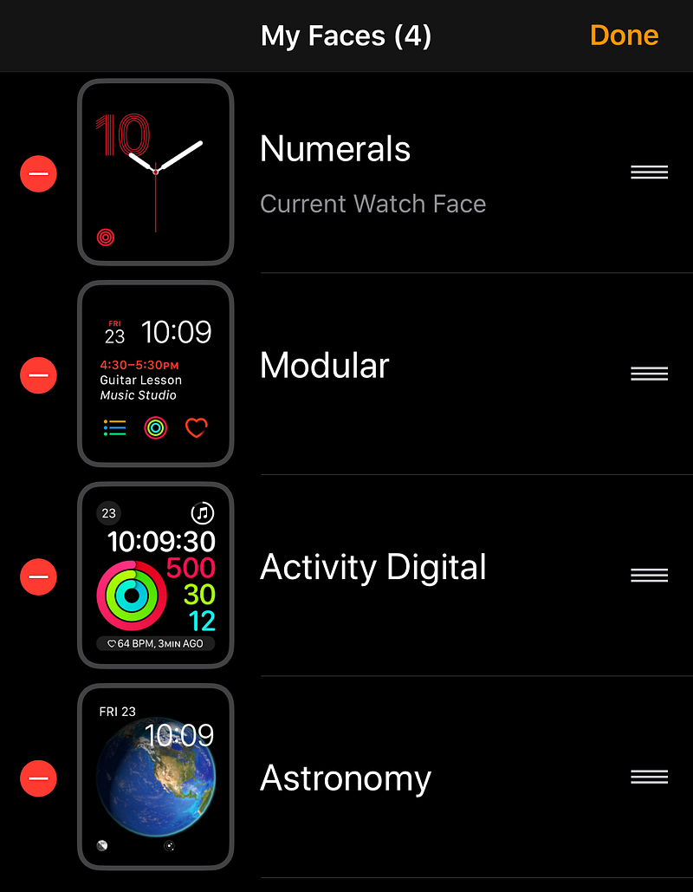
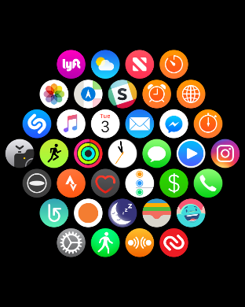
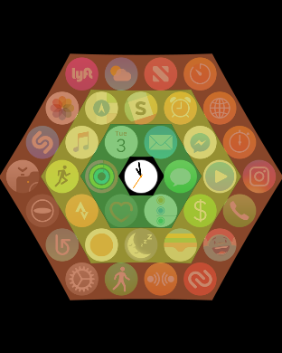
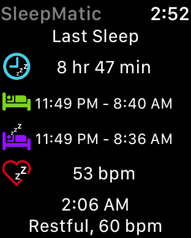

### 1\. Customize your watch faces

By default your watch will come with a bunch of watch faces ready to go. Most likely you won’t ever use a majority of them. The easiest way to customize your faces is through the [Watch app](https://itunes.apple.com/us/app/watch/id1069511734?mt=8) on your phone. I recommend you look through the Face Gallery to find the faces that best suit your needs and personality. For me, my main watch face is Numerals because I like the minimal look of it. It’s followed by a Modular watch face which allows for more of my most used complications. I then have an Activity Digital face for exercise, and an Astronomy face because I like space 🚀.

### 2\. Organize your apps

When you first setup your Apple Watch, you will be asked if you want to download all your current watch enabled apps. I recommend NOT doing this. You will find that many of your [iPhone](https://hackernoon.com/tagged/iphone) apps have watch apps you won’t ever use. Instead, setup your watch with only the default apps installed, and use the Watch app on your phone to add others.

Once you have your apps installed, you can move them around¹ by going to the App Layout section of the Watch app on your phone. The key thing to remember is that your watch’s time app is always center. This means that when organizing your apps, you want to put your most used apps closest to the time app. Below you can see highlighted concentric hexagons of apps in relation to the time app.

### 3\. Setup your watch for health tracking

One of the larger benefits of having a smart watch is the ability to track your health and fitness. The first thing you’ll want to do is make sure you have your Health app setup and filled out. You’ll want to input your birthday, weight, and height. Once added, you’ll enable basic tracking. This includes exercise activity, how often you stand during the day, steps you take throughout the day, and heart rate.

There are a couple of things to do, and apps to get, to round out the health tracking experience. First, I suggest the [Pedometer app](https://itunes.apple.com/us/app/pedometer/id712286167?mt=8). While your watch (and to some extent your phone) will track steps by default, this app gives you a little more power. It lets you set your step goal and it gives you graphs to view your daily and weekly progress. It also has a nice feature to automatically merge your phone and watch step data. If you don’t have this, then you will get double step counts because both your devices track your movement.

Another app you’ll need is [Sleep Tracker](https://itunes.apple.com/us/app/sleep-tracker-auto-sleep-tracking-watch-monitor/id1179236591?mt=8). If you owned a Fitbit² before getting your Apple Watch, you most likely wore it to bed to track the quality of your sleep. Out of the box, your new watch won’t do this. With Sleep Tracker, you more or less get feature parity with the Fitbit. Although it won’t attempt to track REM sleep, it does track being in bed awake, light sleep, and deep sleep.

### Do you have tips from setting up your Apple Watch? Let me know in the responses below or send me a tweet to [@ianhirschfeld](https://twitter.com/ianhirschfeld)!

¹ You can also move your apps on your Apple Watch the same way you would move apps on your iPhone. Long tap an icon until it starts to wiggle, and then drag it into the position you want.

² Unfortunately, Fitbit **does not** sync with the Health app by default. Which means all that data you’ve been collecting will be thrown out if you don’t add it to Health. To do that you will need the help of a third party app called [Sync Solver](https://itunes.apple.com/us/app/sync-solver-for-fitbit/id935306292?mt=8). As of this post it costs $2.99, which isn’t too bad if you have months or years of data that you don’t want to lose.

_Ian Hirschfeld is an iOS/Virtual Reality Consultant and Developer. He runs office hours every week for anyone interested in_ [_learning_](https://hackernoon.com/tagged/learning) _more or wanting to chat about VR, AR, and the other Rs. Schedule a video chat at_ [_https://calendly.com/ianhirschfeld_](https://calendly.com/ianhirschfeld)_._
