Entering the new year has been bitter sweet for me. On the plus side, I will be starting a new job at a company I’m very excited to be working for (more on this later), but sadly that means I will no longer be working on [The Soap Collective](http://www.thesoapcollective.com/) in a full-time capacity.

Soap was borne out of the desire for [Logan Dwight](https://medium.com/u/568c2ecc7fee) and I to explore creative storytelling through future tech. Our goal was to create experiences that were diverse and inclusive. Experiences that glorified traits we felt lacked significant representation in our media such as empathy, creativity, and curiosity. When we launched the company, we wanted our first piece of public work to be an original project that showcased our ethos. So in 2014 we began working on an iOS app called [_Role_](http://www.roleapp.com/). Our pitch was, “make _Dungeons & Dragons_ as easy to play as _Apples to Apples_”. We wanted to create a product that utilized the power of mobile phones to enable people to use their imagination with their friends. We also set out to create characters within the app that weren’t stereotypes of their gender, ethnicity, or occupation. We launched _Role_ in early 2015 to positive feedback and reviews.

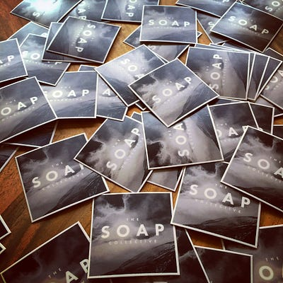

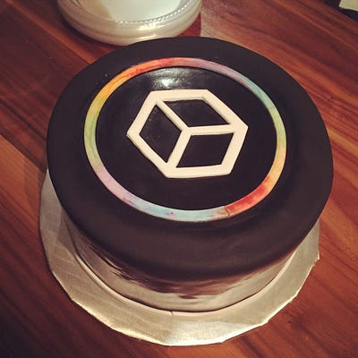

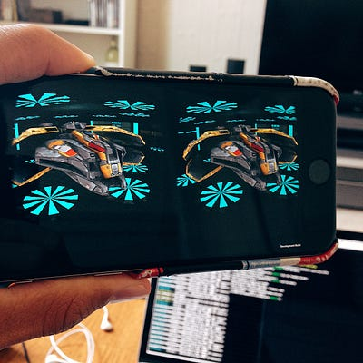

From 2015 on, we continued to create our own internal projects while also pursuing working relationships with other companies and brands. Over the last few years we’ve had the opportunity to work with artists, entrepreneurs, startups, and corporations across various platforms including web, mobile, and virtual reality. VR is where we always wanted to end up, and it was a dream come true to catch the industry just as it was starting to gain real traction. Although we started playing around prototyping VR experiences in 2015, our first public VR project was a [360 degree music video](https://www.youtube.com/watch?v=_dw-Q6seOOk) that we produced in April of 2016. It was an awesome opportunity for us to work on a music video, and it helped launch the VR portion of our portfolio. We would end up doing ten other 360 video shoots before the year was over. As we moved into being a VR only studio, we grew the team from two to six people, and expanded into working on CG VR. This lead to our biggest project, a roomscale VR travel experience called [_Beyond Tokyo_](http://www.beyondtokyovr.com/)_,_ that is set to launch later this year.

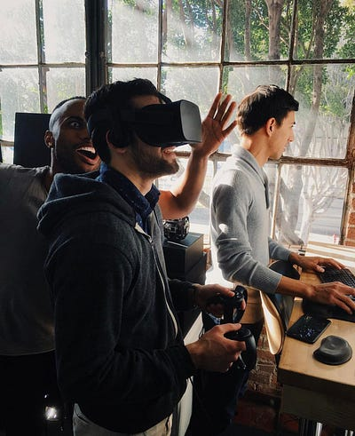

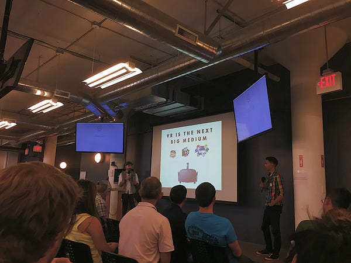

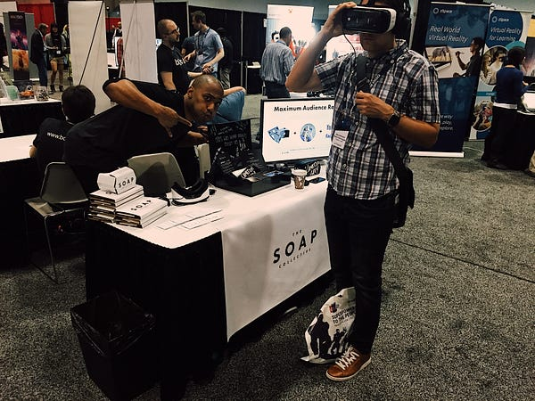

Ultimately, as a VR studio, we could not create the sustainable revenue we needed to the support the amazing team we had built. And so, over the summer we decided to finish up our current batch of projects, and spend the rest of 2017 trying to get everyone situated going into the new year. The past four years have been a lot of work, and saying I’ve learned a ton is an understatement. I’ve gotten to work on some amazing projects and I’ve met even more amazing people. A huge thank you to [Jarreau Bowen](https://jarreaubowen.com/), [Mike Ackerman](http://mikeackermanart.com/), [Eleanor Wingo](https://www.artstation.com/ellewingo), and [Derek Kruk](http://www.derekkruk.com/) for joining Logan and myself, and working with us on building this company!

_A few of my former colleagues are either freelancing or looking for full-time work, if you are in need of any art (2d/3d) or production help,_ [_send me a message_](mailto:ian@thesoapcollective.com)_._

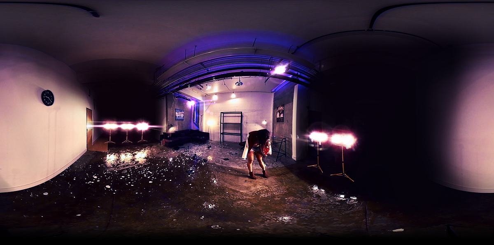

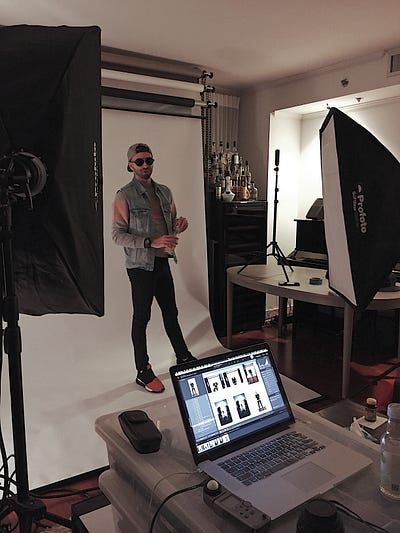

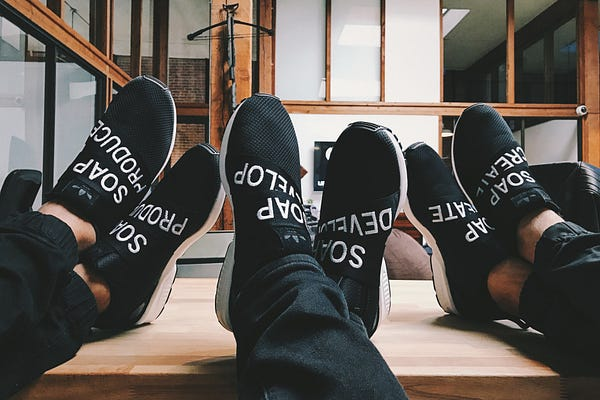

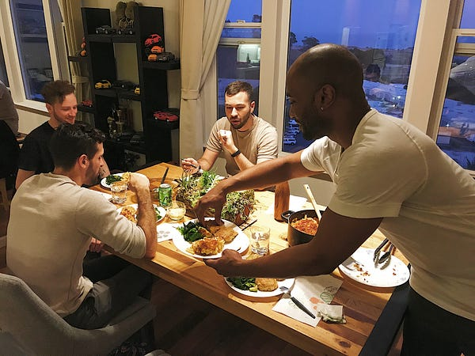

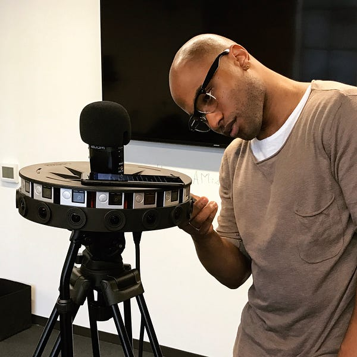

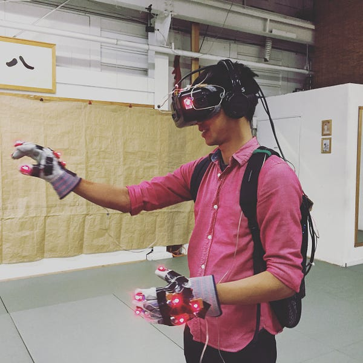

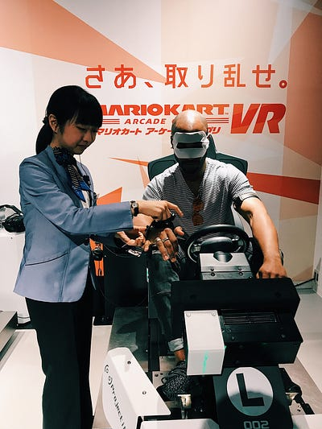
