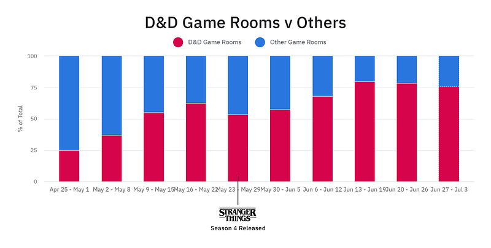
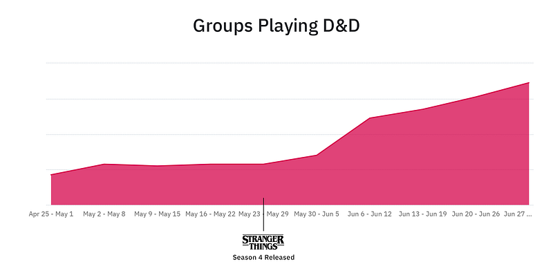

It’s no secret that **_Dungeons & Dragons_ (D&D)** has had a significant presence in since Season 1. Its showrunners, The Duffer Brothers, have spoken extensively about how roleplaying, specifically D&D, has influenced their initial pitch for season one and the following seasons. There are even theories that _Stranger Things_ could just be one giant D&D adventure. With the show’s massive growth in popularity, it is now paying back that influence by encouraging a new wave of people interested in playing D&D for the first time.

At [Role](https://www.playrole.com), we see roleplaying parties spending thousands of hours every week playing their favorite tabletop games. We took a look at some of our data to see if there was any noticeable connection between the latest season of _Stranger Things_ and an increased interest in D&D. It turns out there was!

Leading up to the release of _Stranger Things_ Season 4, [D&D Game Rooms](https://app.playrole.com/rooms/new?playkit=1) averaged 47% of all game rooms created each week. Since the start of the new season, D&D Game Rooms have increased to 72% of game rooms created.

It’s not only the creation of D&D Game Rooms that has increased since the latest season has dropped. Over the last month, the number of people playing D&D on Role has seen a 140% increase. What’s even more interesting is that not only are more people participating in D&D campaigns, but they are also spending more time playing per session. On average, game sessions of D&D have increased in time played by 28%.

Overall, interest in _Dungeons & Dragons_ from game masters and players has exploded. People coming to learn how to play D&D on Role have increased a whopping 285%!

It’s incredible to see a show come out influenced by a tabletop roleplaying game, and to have it become so popular that it pushes that influence back into the game itself. We’ve been watching this push-and-pull trend with TTRPGs and other media and cannot be more excited about what it means for the future of this industry.

At [Role](https://www.playrole.com), we strive to be the easiest place to play _Dungeons & Dragons_. To that end, we have some exciting updates coming this week. Look out for our upcoming release that includes the ability to use your **D&D Beyond** Characters directly on Role, as well as a brand new **5e Adventure** to onboard new and experienced players alike into playing D&D online.
