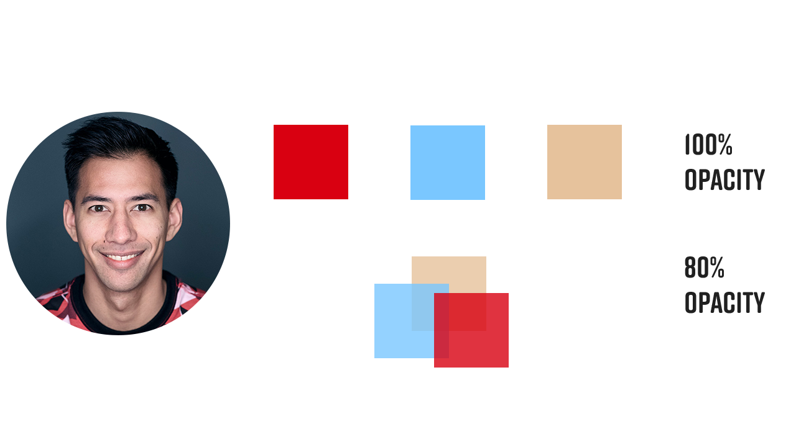
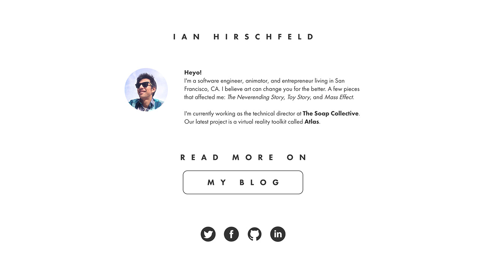
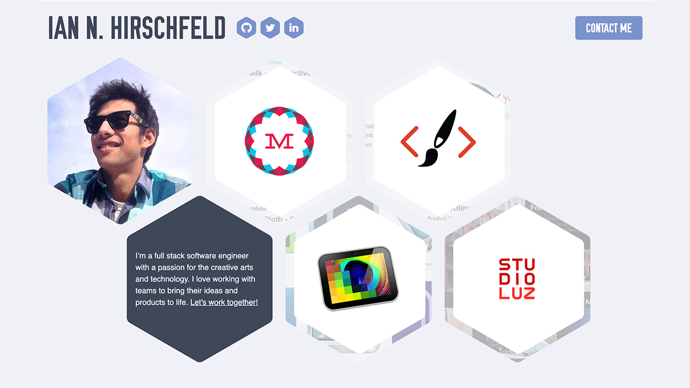
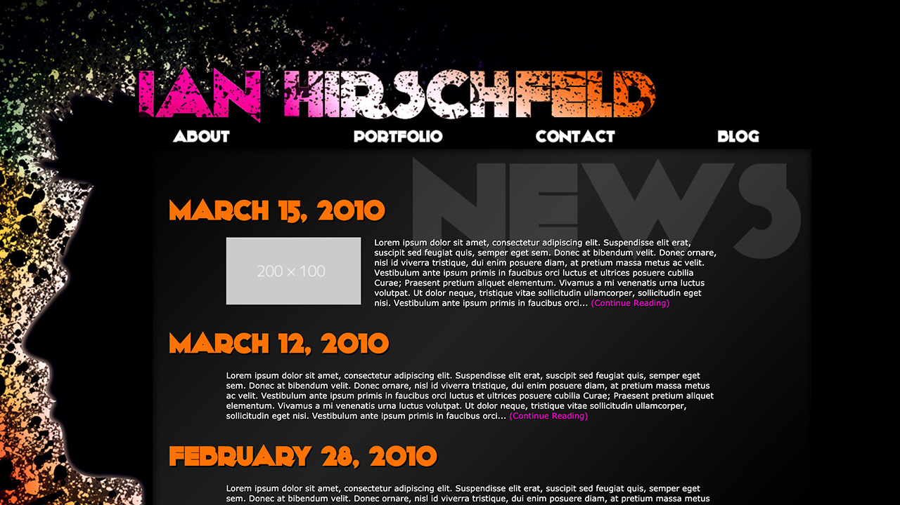
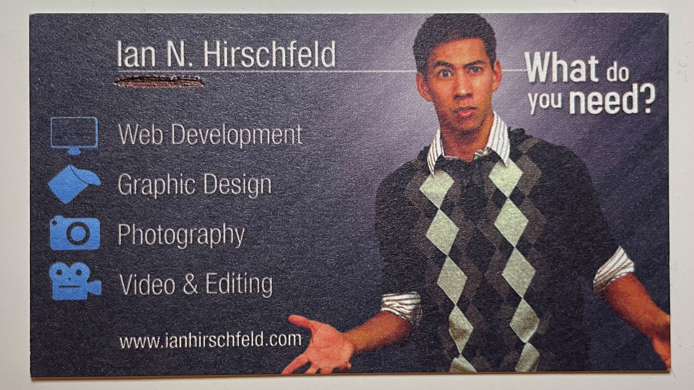

Well 2020 was a wild year! Not just because of the pandemic and the political crisis the U.S. is in, but also because of the personal and life changes I went through. Since I’ve staked my career in software and the tech industry, I very much link my personal website with my identity. So every now and then when I reflect on my life and acknowledge the areas I’ve grown and changed, I inevitably take a look at my personal site to gut check whether it still represents _me_. As I was hanging out at home during my holiday break, I felt it was time to make an update. As of the beginning of this new year, I have launched latest iteration of ianhirschfeld.com that you see here.

The last couple of versions of my site have been loosely tied to the branding of an agency I used to run. The agency’s branding was minimal, black & white, and used sans-serif font with sharp edges. Now that I’m no longer working at that agency, I wanted to reintroduce some color back into my personal brand. I’ve also grown to appreciate more organic shapes and rounded edges instead of sharp ones.

Since I have many social media accounts, I tend to use the same profile photo across all of them. To stay consistent I wanted to showcase my profile photo on this site as well. With that in mind, I decided to try and pull colors from my photo to see if they could work as the site’s color palette. I was happy to discover they did! I was able to pull a red, blue, and tan color that are the site’s primary colors. Red is my favorite color and I enjoy that it can represent love, warmth, and passion. The blue, repenting stability and serenity, is a great way to have contrast against the red and still allow for some vibrancy. The tan, which I pulled from my skin tone gave me a neutral color that serves as the background of this site. My color palette is a literal representation of me.

With colors figured out I set my sights on fonts. I was scoping out some other side projects of mine and couldn’t stop referring to cinepocalypse.com. I found the fonts on that site some time ago and really enjoy them. They read cleanly, are sans-serif, and have some roundedness. For headings I’m using Rift Soft, which offer a bold, all caps look with no hard edges. For body copy I’ve got Freight Sans Pro. Together, they give great readability and have heavy contrast between headings and body copy. They may end up being the fonts I use for all my side-projects.

Lastly, I wanted one design element that I created or used in a way that felt unique to me and my site. Thinking back on how to make my site feel a little more organic, I went looking for shape inspiration. I came across [Blob Maker](https://www.blobmaker.app/) which instantly became something I wanted to use. After some experimenting with shapes I generated, I was enjoying how red, blue, and tan blobs sat on top of each other. I realized that one final piece they were missing was some motion. Adding just a little bit of movement and morphing animations to the blobs gave me a really nice effect that I feel gives the site some life without being too distracting.

## A Stroll Through Past Sites

This is the sixth iteration of my website, below are my previous four. Unfortunately, the first version of my portfolio site has been lost. However, I do have a business card that I based off the design of the site! Enjoy :)

### V5 (2017-2020)

### V4 (2014-2017)

### V3 (2014-2014)

### V2 (2010-2014)

### V1 (2008-2010)

