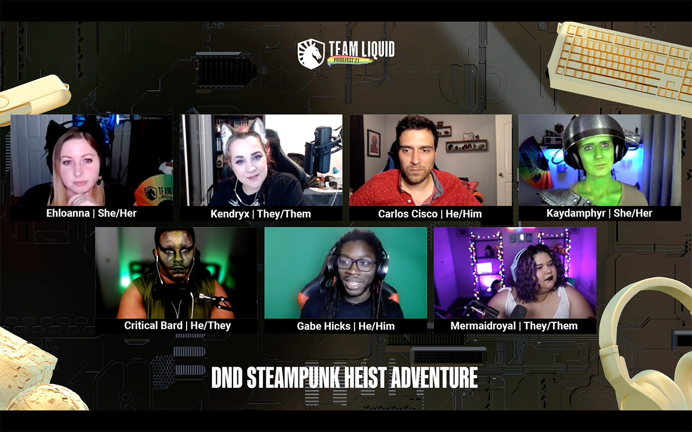

Something really cool happened on Friday: Team Liquid, one of the premier esports organizations, hosted a massive PrideFest stream that was a Dungeons & Dragons one-shot. That’s right, the org with teams for every major esports game and dozens of championships, empowered Game Master [Gabe Hicks](https://twitter.com/GabeJamesGames) to take over their stream for a roleplaying session. This is amazing in multiple ways and I believe a historic moment for tabletop roleplaying games!

<blockquote class="twitter-tweet" data-dnt="true">
The D&amp;D Heist with <a href="https://twitter.com/GabeJamesGames?ref_src=twsrc%5Etfw">@GabeJamesGames</a> is 🔴LIVE!  📺 <a href="https://t.co/Du6vcB7e88">https://t.co/Du6vcB7e88</a> <a href="https://t.co/p3F3CuGtFK">pic.twitter.com/p3F3CuGtFK</a>
&mdash; Team Liquid (@TeamLiquid) <a href="https://twitter.com/TeamLiquid/status/1408627585614024706?ref_src=twsrc%5Etfw">June 26, 2021</a></blockquote>

First off, having this stream being run under the banner of PrideFest meant it was explicitly in support of the LGBTQIA+ community. The panel of players were diverse across ethnicity, gender identity, and sexual orientation. The chat was loving it and enjoyed the cast members that had full on costumes and makeup. It was quite the sight to see! It felt like an important stream for these types of games and this community of people.

Secondly, it’s key to note that Team Liquid is not small. As of this post, they have 16 professional teams, 709K Twitter followers, and 83K Twitch followers. This means that anything they promote, and have running on their stream, is going to have an audience. This one-shot was hovering between 15-16K live viewers for the entire session! These are streaming numbers that only a handful of the most popular actual play streams get.

What’s more is that based on the chat, there were many people being newly exposed to TTRPGs and D&D. If there is one thing D&D has been doing a phenomenal job of, it’s getting their brand out to the general public and expanding their audience beyond what has traditionally been a hardcore player base. It was really cool to see many people in chat expressing their interest in D&D and even more people saying they have never played but love watching actual play streams. There were several people saying things along the lines of “I don’t know what I stumbled upon, but I am here for it!”.

At [Role](https://www.playrole.com/), we often talk about how we believe that the behaviors that lead people to become invested in sports teams and their players are very similar to how audiences get invested into long running roleplaying campaigns. If you look at a campaign of Critical Role, their viewers are invested in more than just the story, they are in love with the cast & characters. They know each character’s name, background, and stats. They are invested in seeing them play through an adventure full of action & emotion over the course of months, or even years! Experiencing an audience of traditional esports fans enjoy this one-shot stream felt like validation of this idea and was very exciting to see!

I’m hoping we get more of this Esports x Actual Play crossovers. I believe it has potential to be a large growth vector for tabletop roleplaying games. For now, I’m just so thrilled to have seen this stream happen and all the newly exposed people take to roleplaying so openly. Let this be continued fuel for the growth the TTRPG industry!

_If you’d like to watch the one-shot it’s on the [Team Liquid Twitch here](https://www.twitch.tv/videos/1067758814?t=02h30m55s)._
