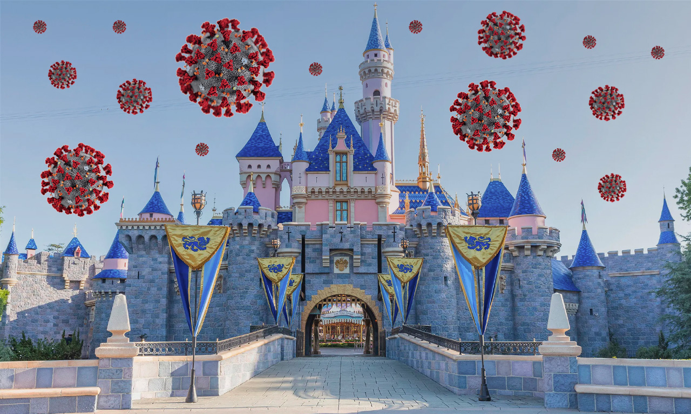

I recently had the wonderful opportunity to spend a day at Disneyland with my best friend after we had been apart & quarantining for a majority of the pandemic. When we finally felt we were comfortable getting together and going out somewhere, we met up armed with masks on our faces and the vaccine coursing through our bodies. While these measures certainly made me feel safe enough to venture to such a public place as Disneyland, I was shocked at how COVID unsafe the magic kingdom was. Disneyland is, without a doubt, a COVID super spreader hotspot!

## Limited capacity? Nope, the more the merrier!

Prior to June 15th, Disneyland California had limited capacity somewhere in the range of 15-35%. Since the state’s “reopening” that limit has been vaguely lifted. Apparently it hasn’t been lifted enough to allow fast pass purchases again, but it was enough that the park was more or less packed. I was ~~shocked~~ ~~impressed~~ concerned by how many people were actually allowed in the park at one time. If there was any limit on capacity, it certainly didn’t look or feel like it. Once we hit peak hours, lines for the popular rides were as long as two hours!

## Social distancing, what even is it?

During the pandemic I found my personal space bubble expand to that CDC recommended 6ft. This never really felt like that was that large or that crazy of an adjustment, but at Disneyland I was reminded how unusual a six foot bubble really is. Waiting in line for rides is a theme park staple, but even while being in a reopened state, I was taken aback by the complete lack of social distancing. Lines were packed as if the pandemic was never a thing. People were right up against each waiting in the hot sun, and made no effort to give each other space even as people shuffled into enclosed spaces.

The rides themselves made no use of social distancing or limited capacity. I had anticipated maybe an every other seat policy, but alas that was not a thing. I had also naively assumed that rides would be regularly wiped down considering how many bodies were moving through them and all the ways different people would be touching handle bars and seat belts. However, I saw no effort by any employees to ever disinfect any part of any of the rides or attractions.

## Masks be damned!

At the very least I was expecting a decent amount of people to be wearing masks while at the park. Surely even if people were fine with going out and being in crowds, the fact that only 50-60% of the U.S. population is vaccinated would mean _most_ people would mask up. Not even a little bit. Observationally, I saw at best 5% of attendees were wearing masks. To Disney’s credit, this is the one precaution I saw all employees taking. So whether required or optional, every employee was wearing a mask.

## Fun was still had :D

Despite there being way more people at the park than I expected, despite no social distancing or anyone wearing masks, despite actually hearing a couple of guys gloat about NOT getting vaccinated before coming to Disney, I still had fun. I still enjoyed my time with my best friend at Disney. We spent a majority of our time in the new Star Wars area and it truly was a magical space. And although there was a statistical certainty that COVID was present the day we went, we thankfully have shown no symptoms since coming home. I look forward to the time where I don’t even need to be concerned with anything in this post and going to Disneyland can be stress free (at least terms of COVID). Until then I will be keeping my visits to a minimum, if I even dare go back any time soon.
